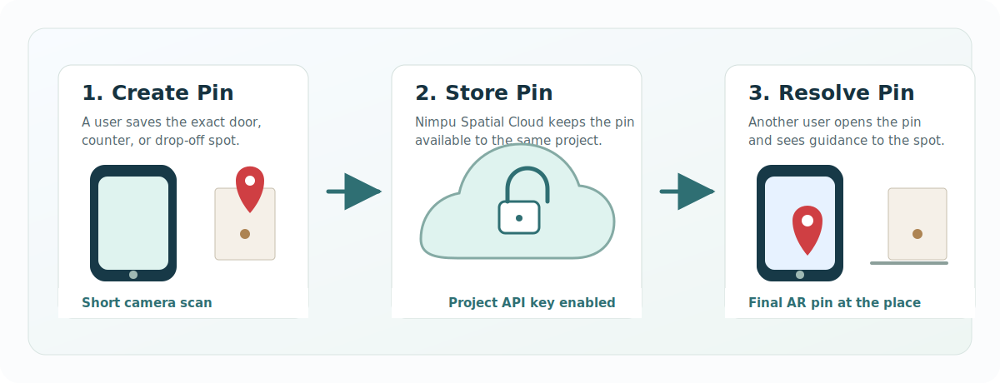
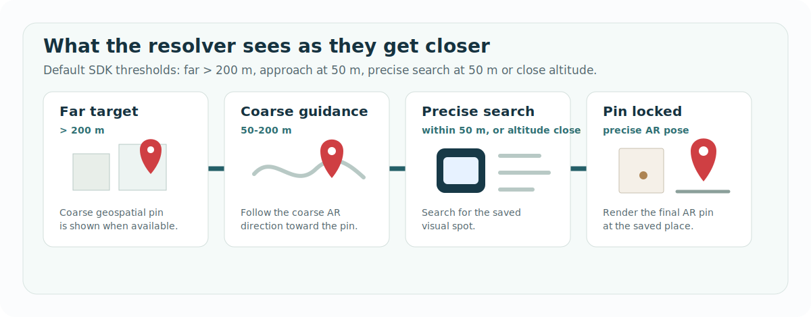

# Nimpu Spatial Android

Nimpu Spatial Android helps an app guide someone to an exact real-world spot that another user has saved earlier.

GPS can get a person near a building. Outdoor AR guidance can help near the entrance. But the final few meters are often still ambiguous: the right apartment door, delivery handoff point, room entrance, shop counter, or campus landmark. Nimpu Spatial lets one user create a spatial pin at that exact place, and lets another user resolve it later with AR guidance.

The clearest example is last-mile delivery: one user pins their exact door, and a delivery driver can later find that precise door instead of stopping at a vague map location.



## What This SDK Does

- Creates an AR pin at an exact physical place.
- Stores the pin through Nimpu Spatial Cloud for the developer project.
- Lists and prepares pins so another user can resolve them.
- Supports coarse geospatial guidance when ARCore Geospatial is configured.
- Runs precise visual resolve near the saved spot and returns the final AR pose.
- Provides a runnable Android sample app and integration docs.

## How A Pin Is Resolved

The resolver experience changes with distance. Your host app can still use its own map or navigation product outside the SDK, but the Nimpu Spatial resolve flow uses these default stages:



1. **Far target, more than 200 m:** the sample shows the coarse geospatial pin state when available.
2. **Coarse guidance, 50-200 m:** follow the coarse AR/geospatial direction toward the saved place.
3. **Precise search, within 50 m or close altitude:** the SDK starts searching for the saved visual spot.
4. **Pin locked:** render the final AR pin at the exact place.

## Common Use Cases

- Delivery drivers finding the exact apartment door or drop-off point.
- Field teams locating a utility point, equipment room, or site marker.
- Visitors finding a building entrance, office, venue gate, or help desk.
- Internal apps that need to save and revisit precise physical locations.

## Get Started

1. Create a project API key in the Nimpu Spatial Developer Portal: [spatial.nimpu.in](https://spatial.nimpu.in/).
2. Copy `local.properties.example` to `local.properties`.
3. Set your project key:

```properties
NIMPU_API_KEY=nsk_...
NIMPU_ENABLE_GEOSPATIAL_GUIDANCE=true
```

4. Open this repository in Android Studio.
5. Run the `sample` app on an ARCore-supported Android device.

The sample package name is:

```text
com.example.spatialsdk.sample
```

If geospatial guidance is enabled, configure ARCore Geospatial access for this package name and your signing certificate in Google Cloud.

See [Getting Started](docs/getting-started.md) for the full setup path.

## SDK Initialization

Initialize the SDK once before Create or Resolve flows:

```kotlin
NimpuSpatialSdk.initialize(
    context = applicationContext,
    config = NimpuSpatialConfig(
        apiKey = BuildConfig.NIMPU_API_KEY,
        geospatialGuidanceMode = GeospatialGuidanceMode.ENABLED
    )
)
```

Nimpu Spatial Cloud activation with a project API key is required for the public SDK.

## Current Distribution

The current public integration path is AAR-based. Maven publishing is not yet available.

For the sample app in this repository, Gradle consumes the local `:sdk` module directly. For an existing app, download the SDK AAR from a Nimpu Spatial release and add it to your app's `libs/` directory:

```kotlin
dependencies {
    implementation(files("libs/nimpu-spatial-android-0.1.0.aar"))
}
```

## Repository Contents

- `sdk/`: Android SDK module with the public Kotlin API and prebuilt spatial core.
- `sample/`: runnable Android sample app showing Create Pin, Resolve Pin, saved pins, retry upload, and support logs.
- `docs/`: setup, integration, cloud, geospatial, diagnostics, and troubleshooting docs.

## Documentation

- [Getting Started](docs/getting-started.md)
- [Android Integration](docs/android-integration.md)
- [Cloud Mode](docs/cloud-mode.md)
- [Geospatial Setup](docs/geospatial-setup.md)
- [Diagnostics](docs/diagnostics.md)
- [Troubleshooting](docs/troubleshooting.md)

## Security And Logs

Do not commit `local.properties`, API keys, signing keys, or private app credentials. Share Log output is intended for support/debugging and should not include raw pin data, full signed URLs, API keys, or user PII.

## Contact

For integration questions, support, or licensing terms, contact jambusushanth@gmail.com.

## License

The Kotlin SDK wrapper source, sample app source, Gradle configuration, and documentation are licensed under Apache License 2.0.

The prebuilt spatial core binary at `sdk/src/main/jniLibs/arm64-v8a/libspatial.so` is proprietary to Nimpu and is not licensed under Apache License 2.0. See [BINARY-LICENSE.md](BINARY-LICENSE.md).

## Status

This is an early Android SDK release. The API may change before a stable release.
